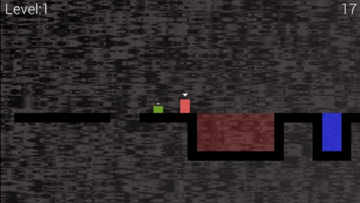
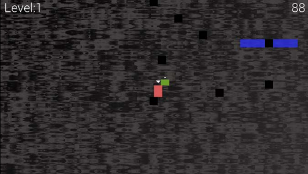
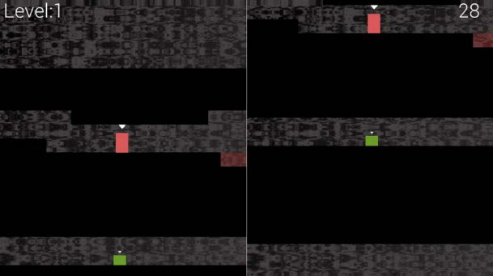

# Thomas and Bob: Game Overview

## Introduction
Welcome to **Thomas and Bob**, a cooperative 2D puzzle-platformer inspired by *Thomas Was Alone*. This game requires two players to work together and race against the clock.





## Gameplay Overview
In **Thomas and Bob**, players navigate through levels filled with challenges that require the unique attributes of their characters. Each character's abilities, such as height, jump, and power, must be used strategically to solve puzzles and overcome obstacles.

### Key Features
- **Cooperative Gameplay**: Two players must collaborate to progress through levels.
- **Diverse Challenges**: Leverage each character's unique attributes to solve puzzles.
- **Race Against the Clock**: Each level is timed, adding an exciting layer of difficulty.
- **Multiple Levels**: The game contains 4 challenging levels, each designed to test your skills and teamwork.

## Controls
- **Esc**: Exit the game
- **Enter**: Start/Pause the game
- **Q**: Switch camera between Thomas and Bob in fullscreen mode
- **W/A/D**: Move Thomas
- **Arrow Keys**: Move Bob
- **E**: Enable/Disable split-screen mode

## Requirements
- **C++11**
- **SFML 2.6 (x32 version)**

## How to Build

### Step-by-Step Instructions
1. **Open the Project in Visual Studio**
    - Open the project file in Visual Studio.

2. **Project Properties Configuration**
    - Go to `Project -> ThomasWasLate properties...`.

3. **Include Directories**
    - Select `All Configurations`.
    - In `C/C++ -> General -> Additional Include Directories`, append the `include` directory of the SFML library.

4. **Library Directories**
    - In `Linker -> General -> Additional Library Directories`, append the `lib` directory of the SFML library.

5. **Debug Configuration**
    - Select `Debug`.
    - Append the following string to `Linker -> Input -> Additional Dependencies`:
      ```
      sfml-graphics-d.lib;sfml-window-d.lib;sfml-system-d.lib;sfml-network-d.lib;sfml-audio-d.lib;
      ```
## Credits:

Thomas And Bob is based on ideas and concepts from "Beginning C++ Game Programming" by John Horton. Special thanks to the SFML development team for providing the graphics library that powers the game.
